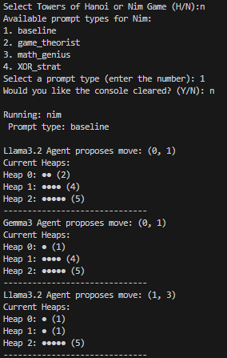
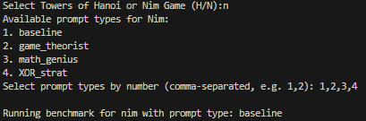

# LLM Agent Duel ⚔️
Duel Large Language Model (LLM) agents in the classic Towers of Hanoi puzzle and Nim Game! Benchmark any model (e.g., Gemma3, Llama 3.2) through a variety of prompts!

## Screenshots 📸

Single game of Nim via `main.py`.



Game and prompt selection for `benchmark.py`.




### Getting Started 🚀

To contribute to this project or run the program, follow these steps:

1. **Download the Project Files**:
   - Clone the repository:
    ```bash
    git clone https://github.com/gbsierra/LLM-Agent-Duel.git
    ```

2. **Create virtual python environment**:
    ```bash
    # Windows (Command Prompt)
    python -m venv venv
    venv\Scripts\activate

    # Windows (PowerShell)
    python -m venv venv
    .\venv\Scripts\Activate.ps1

    # macOS/Linux
    python3 -m venv venv
    source venv/bin/activate
    ```

3. **Install Dependencies**:
    ```bash
    pip install -r requirements.txt
    ```

4. **Run your benchmarks, then visualize**:
    ```bash
    # Start a single game, watching each model's move
    # (You will select your game and prompt type)
    python main.py

    # Start benchmarking, viewing only game completions
    # (You will select your game and prompt types)
    python benchmark.py

    # Create plots of benchmarks
    # (Ensure your benchmarks are in /benchmarks/nim & /benchmarks/hanoi, respectively)
    python visualization.py
    ```

That is all! You are now ready to explore, contribute, and run the application. Head to the 'agents' directory to customize any prompt or choose from the full list of models https://ollama.com/search.

